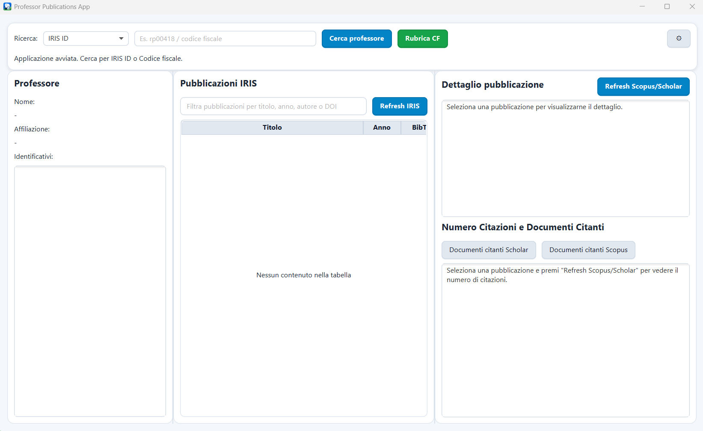
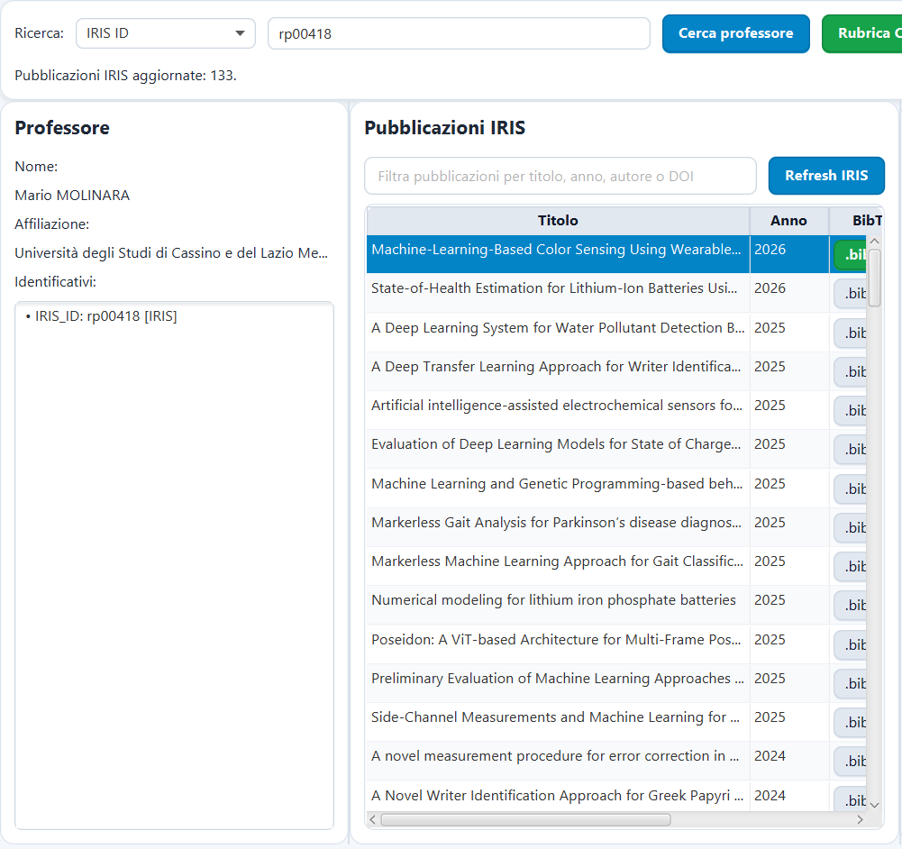
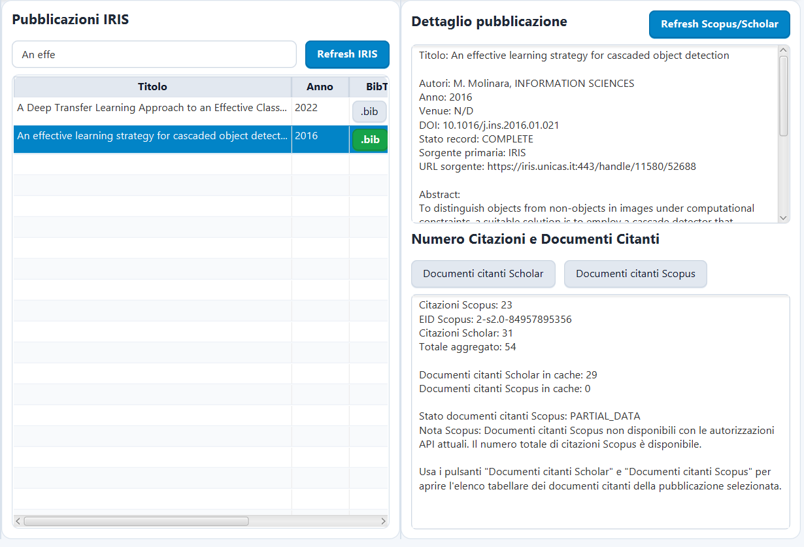
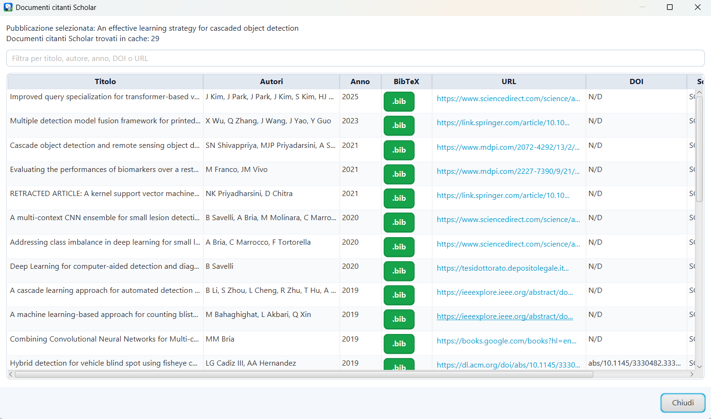
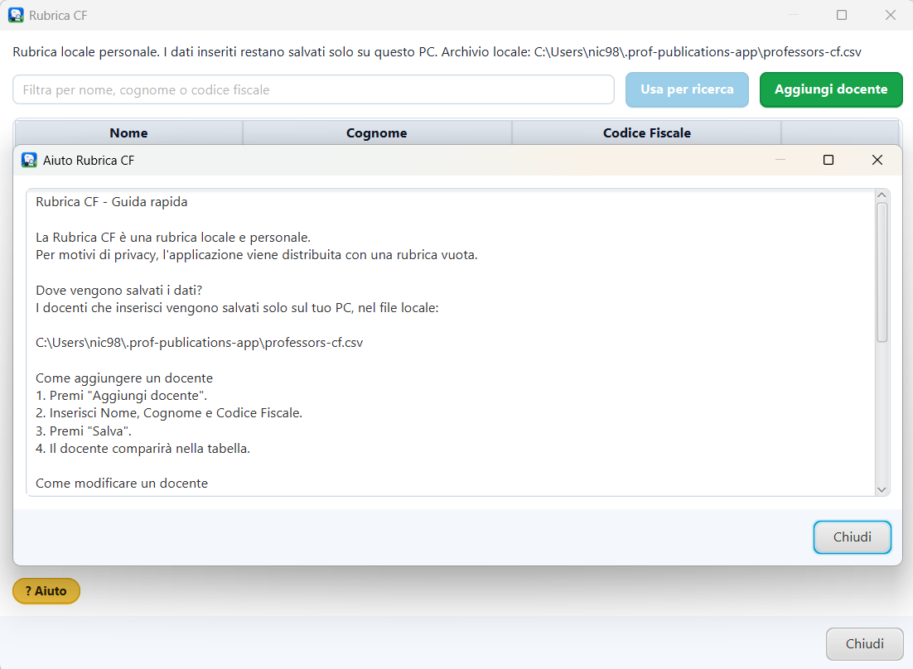

# Professor Publications App

Desktop application JavaFX per la ricerca di professori, il recupero delle pubblicazioni scientifiche da IRIS/CINECA, l'integrazione di dati citazionali da Scopus e Google Scholar tramite SerpApi, e l'esportazione delle citazioni in formato BibTeX.

Il progetto è stato sviluppato come applicazione Java 21 + JavaFX 21 + Maven, con cache locale SQLite e distribuzione tramite JAR.

---

## Screenshot dell'applicazione

### Schermata principale



### Ricerca professore e pubblicazioni IRIS



### Dettaglio pubblicazione e citazioni



### Documenti citanti Scholar



### Rubrica CF locale



---

## Video demo

Video dimostrativo dei principali casi d'uso dell'applicazione:

```text
INSERIRE_LINK_VIDEO_DEMO
```

Il video mostra:

* avvio dell'applicazione;
* configurazione delle API key;
* ricerca professore tramite IRIS ID;
* recupero pubblicazioni IRIS;
* visualizzazione dettaglio pubblicazione;
* refresh citazioni Scopus/Scholar;
* apertura documenti citanti Scholar;
* export BibTeX;
* uso della Rubrica CF locale.

---

## Funzionalità principali

L'applicazione permette di:

* cercare un professore tramite IRIS ID o codice fiscale;
* recuperare le pubblicazioni istituzionali da IRIS/CINECA;
* visualizzare titolo, autori, anno, DOI, venue, abstract e sorgente;
* recuperare il numero di citazioni da Scopus;
* recuperare dati citazionali e documenti citanti da Google Scholar tramite SerpApi;
* mostrare stati parziali dei dati quando una sorgente non restituisce tutte le informazioni;
* esportare citazioni in formato BibTeX;
* copiare BibTeX negli appunti;
* salvare file `.bib`;
* gestire una Rubrica CF locale e personale;
* usare una cache SQLite locale.

---

## Sorgenti dati integrate

| Sorgente                 | Ruolo                                                                       |
| ------------------------ | --------------------------------------------------------------------------- |
| IRIS/CINECA              | Sorgente istituzionale primaria per professori e pubblicazioni              |
| Scopus API               | Sorgente bibliometrica ufficiale per citation count e identificativi Scopus |
| SerpApi / Google Scholar | Sorgente secondaria per dati Scholar e documenti citanti                    |

L'applicazione non usa scraping diretto di Google Scholar. L'accesso a Scholar avviene tramite SerpApi.

---

## Tecnologie utilizzate

* Java 21
* JavaFX 21
* Maven
* SQLite
* Jackson
* Scopus API
* SerpApi
* IRIS/CINECA REST services
* BibTeX

---

## Architettura

Il progetto è organizzato a layer:

```text
src/main/java/com/iadanza/profpublicationsapp
├── ui
├── application
├── domain
├── infrastructure
└── bootstrap
```

### Layer principali

* `ui`: JavaFX application, dialog, formatter e componenti grafici;
* `application`: servizi applicativi e casi d'uso;
* `domain`: modelli di dominio, enum e oggetti principali;
* `infrastructure`: connector esterni, configurazione, repository e persistenza;
* `bootstrap`: inizializzazione dei servizi e wiring delle dipendenze.

### Connector principali

* `IrisConnector`
* `ScopusConnector`
* `ScholarConnector`
* `RealIrisConnector`
* `RealScopusConnector`
* `SerpApiScholarConnector`

Ogni sorgente esterna è isolata dietro un'interfaccia dedicata, così la UI non dipende direttamente dai dettagli delle API.

---

## Requisiti

Per avviare l'applicazione è richiesto:

* Windows 10/11;
* Java 21 o superiore.

Verifica della versione Java:

```powershell
java -version
```

Output atteso:

```text
java version "21..."
```

Se viene mostrato Java 17 o inferiore, installare Java 21 e configurare correttamente `PATH` o `JAVA_HOME`.

---

## Avvio dell'applicazione da ZIP/JAR

La distribuzione finale contiene:

```text
prof-publications-app-v1.0/
├── prof-publications-app.jar
├── run-app.bat
├── README_AVVIO.md
└── lib/
```

Per avviare l'applicazione:

1. estrarre lo ZIP;
2. aprire la cartella estratta;
3. eseguire `run-app.bat`.

Lo script `run-app.bat` controlla automaticamente:

* presenza del JAR;
* presenza della cartella `lib`;
* presenza di Java;
* versione Java almeno 21.

---

## Avvio da IntelliJ IDEA

Per avviare il progetto da IntelliJ IDEA:

1. importare il progetto come progetto Maven;
2. configurare SDK Java 21;
3. aggiornare/importare le dipendenze Maven;
4. eseguire:

```powershell
mvn javafx:run
```

oppure usare una Run Configuration Maven equivalente.

---

## Generazione della distribuzione

Da root del progetto:

```powershell
mvn clean package
```

La distribuzione viene generata in:

```text
target/dist/
```

Contenuto atteso:

```text
target/dist/
├── prof-publications-app.jar
├── run-app.bat
├── README_AVVIO.md
└── lib/
```

---

## Credenziali e API key

Le credenziali non sono incluse nel repository.

L'app richiede, a seconda delle funzionalità usate:

### IRIS / CINECA

* username IRIS REST;
* password IRIS REST.

### Scopus / Elsevier

* `SCOPUS_API_KEY`;
* `SCOPUS_INST_TOKEN`, opzionale.

### Google Scholar tramite SerpApi

* `SERPAPI_API_KEY`.

Le credenziali vengono inserite dalla schermata **Impostazioni API key** dell'applicazione.

---

## Sicurezza e dati locali

Le API key e le credenziali vengono salvate localmente nel PC dell'utente:

```text
C:\Users\<utente>\.prof-publications-app\settings.properties
```

La Rubrica CF locale viene salvata in:

```text
C:\Users\<utente>\.prof-publications-app\professors-cf.csv
```

Il repository non include:

* API key reali;
* password;
* file `settings.properties`;
* database SQLite locali;
* dati personali della Rubrica CF;
* file `.env` reali.

---

## Cache SQLite

L'applicazione usa SQLite per una cache locale minima di:

* pubblicazioni;
* citation summary;
* documenti citanti.

La cache serve a ridurre le chiamate remote e a riaprire rapidamente dati già recuperati.

---

## Gestione dati parziali

L'applicazione degrada in modo controllato se una sorgente non è disponibile.

Esempi:

* se Scopus restituisce il citation count ma non i documenti citanti, viene mostrato lo stato `PARTIAL_DATA`;
* se SerpApi non restituisce dati Scholar completi, l'app continua a mostrare i dati disponibili;
* se una sorgente non è configurata, il resto dell'app continua a funzionare quando possibile.

---

## Export BibTeX

L'applicazione supporta l'esportazione BibTeX per:

* singola pubblicazione;
* documenti citanti, quando i metadati disponibili sono sufficienti.

La dialog BibTeX permette di:

* visualizzare la citazione;
* copiare il BibTeX negli appunti;
* salvare un file `.bib`.

---

## Rubrica CF locale

La Rubrica CF è locale e personale.

Funzionalità:

* aggiunta docente;
* modifica docente;
* eliminazione docente;
* filtro per nome, cognome o codice fiscale;
* uso del docente selezionato per avviare una ricerca.

Per motivi di privacy, l'applicazione viene distribuita con rubrica vuota.

---

## Test effettuati

Sono stati effettuati test manuali su:

* compilazione Maven;
* packaging Maven;
* avvio da IntelliJ;
* avvio da JAR;
* avvio tramite `run-app.bat`;
* blocco controllato con Java 17;
* avvio corretto con Java 21;
* ricerca professore tramite IRIS ID;
* refresh pubblicazioni IRIS;
* visualizzazione dettaglio pubblicazione;
* refresh citazioni Scopus/Scholar;
* apertura documenti citanti Scholar;
* export BibTeX;
* Rubrica CF;
* ZIP estratto in cartella temporanea.

---

## Limitazioni note

Questa è una versione v1 del progetto.

Limitazioni note:

* il recupero completo dei documenti citanti Scopus può dipendere da permessi API, institutional token o rete/VPN di Ateneo;
* i risultati Scholar dipendono dai dati restituiti da SerpApi;
* la deduplica è progettata per una v1 e può essere estesa;
* il mapping manuale completo dei profili Scholar è predisposto come possibile estensione futura;
* l'app richiede Java 21 o superiore.

---

## Possibili sviluppi futuri

* deduplica avanzata tra IRIS, Scopus e Scholar;
* mapping manuale professore → Scholar Author ID;
* refresh incrementale;
* esportazione BibTeX multipla più avanzata;
* test automatici più completi;
* installer nativo tramite `jpackage`;
* pannello amministrativo per configurazioni avanzate.

---

## Autore

Nicola Iadanza

Progetto sviluppato come applicazione desktop JavaFX per ricerca pubblicazioni, citazioni e BibTeX.
